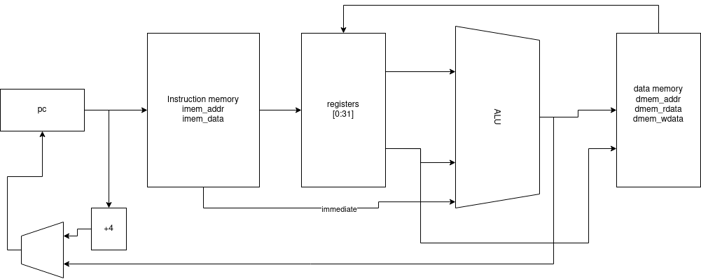

NERV - Naive Educational RISC-V Processor
=========================================

NERV is a very simple single-stage RV32I processor. 
It is equipped with an [RVFI interface](https://github.com/yosyshq/riscv-formal/blob/master/docs/rvfi.md) and is formally verified.



Running the simulation testbench
--------------------------------

```
git clone https://github.com/yosyshq/nerv.git
cd nerv
make
```


Running the riscv-formal testbench
----------------------------------

```
git clone https://github.com/yosyshq/riscv-formal.git
cd riscv-formal/cores/nerv
make -j8 check
```

Updating riscv-formal's included nerv core
------------------------------------------

From root `riscv-formal` directory:

```
git subtree pull --prefix cores/nerv git@github.com:YosysHQ/nerv.git main --squash
```

Updating upstream nerv with changes from riscv-formal
-----------------------------------------------------

From root `riscv-formal` directory:

```
git subtree push --prefix cores/nerv git@github.com:YosysHQ/nerv.git main
```

iCEBreaker SOC example
----------------------

See the [iCEBreaker SOC README](examples/icebreaker/README.md)
